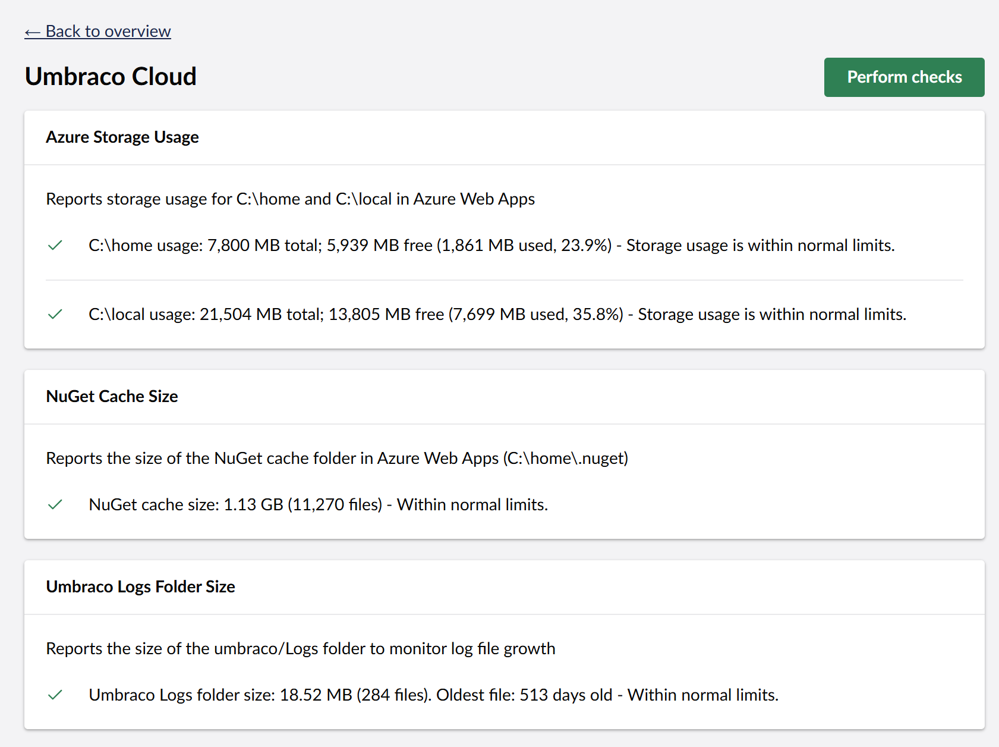

# Umbraco Community Cloud Health Checks

<p align="center">
  
</p>

<p align="center">
  <a href="https://www.nuget.org/packages/Umbraco.Community.Cloud.HealthChecks">
    
  </a>
</p>

A package that provides health checks for Umbraco Cloud environments, helping you monitor critical system resources and storage usage.

> For full package documentation including features, installation, usage, and configuration, see the [Package README](src/Umbraco.Community.Cloud.HealthChecks/README.md).



## Development

### Building the Project

```bash
dotnet build
```

### Packaging

```bash
dotnet pack --configuration Release
```

## Contributing

Contributions are welcome! Please feel free to submit a Pull Request.

1. Fork the repository
2. Create a feature branch
3. Make your changes
4. Submit a pull request

## License

This project is licensed under the terms specified in the [LICENSE](LICENSE) file.

## Credits

Developed by **Crumpled Dog** and the **Umbraco Community**.

## Support

For issues, questions, or feature requests, please use the [GitHub Issues](https://github.com/CrumpledDog/Umbraco.Community.Cloud.HealthChecks/issues) page.
